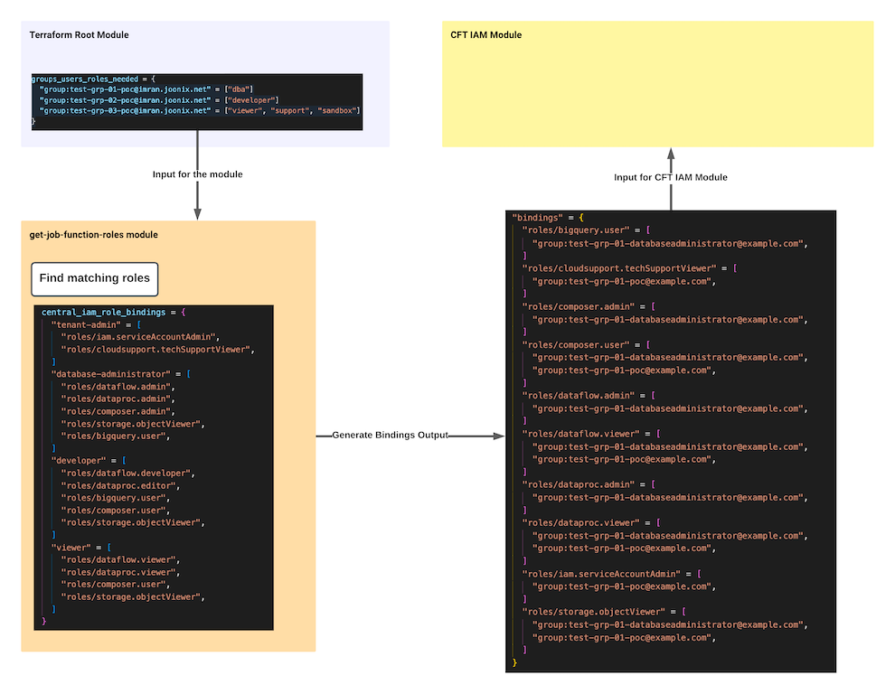

# License  
Copyright 2021 Google LLC. This software is provided as-is, without warranty or representation for any use or purpose. Your use of it is subject to your agreement with Google.

# Get Job Function Roles Module
This module takes a map of job functions for groups/users/service accounts and returns bindings in format which can be passed to [GCP IAM modules](https://github.com/terraform-google-modules/terraform-google-iam). Module does not create any resource. It is used to centrally manage job functions to Predefined role mapping and generate bindings as output.

## Compatibility
This code is intended for use with Terraform 0.14 or higher.

## Usage
Basic usage of this module is as follows:
```terraform
module "get_iam_bindings" {
  source                    = "../get-job-function-roles/"

  groups_users_roles_needed = {
    "group:test-grp-01@example.com"                                         = ["dba"]
    "group:test-grp-02@example.com"                                         = ["developer"]
    "user:test-user-01@example.com"                                         = ["viewer", "support"]
    "serviceAccount:delete-me-svc-acct-1@sinprj.iam.gserviceaccount.com"    = ["developer"]
  }

  custom_iam_job_functions = {
    "sandbox" = [
      "roles/editor",
      "roles/iap.tunnelResourceAccessor",
    ]
    "dba" = [
      "roles/editor",
    ]
  }
  override_job_functions = false
}
```

<!-- BEGINNING OF PRE-COMMIT-TERRAFORM DOCS HOOK -->
## Inputs

| Name | Description | Type | Default | Required |
|------|-------------|------|---------|:--------:|
| custom\_iam\_job\_functions | Map of list of GCP roles for job function. These custom job fnction will merge with predefined job functions in the module | `map(list(string))` | `null` | no |
| groups\_users\_roles\_needed | Map of list of job function roles needed for groups or users | `map(list(string))` | `{}` | no |
| override\_job\_functions | Overrides predefined Job function in the module with custom job function for matching values | `bool` | `false` | no |

## Outputs

| Name | Description |
|------|-------------|
| bindings | Formatted IAM bindings |

<!-- END OF PRE-COMMIT-TERRAFORM DOCS HOOK -->



## group_user_roles_needed
When this module is called from the root module input is provided in `groups_users_roles_needed` as key value pairs. Key is `group:group-email`, `user:user-email` or `serviceAccount:service-account-email`. Value is the list of job functions defined in this module. You can pass 1 or more job functions for each group, user or service account.


Here is an example input

```terraform
  groups_users_roles_needed = {
    "group:test-grp-01@example.com"                                         = ["dba"]
    "group:test-grp-02@example.com"                                         = ["developer"]
    "group:test-grp-03@example.com"                                         = ["viewer", "support"]
    "user:user-01@example.com"                                              = ["viewer", "support"]
    "serviceAccount:delete-me-svc-acct-1@sinprj.iam.gserviceaccount.com"    = ["developer"]
  }
```

## custom_iam_job_functions
Users can also pass values in `custom_iam_job_functions` which is merged with `predefined_iam_job_function` before generating final bindings. It will allow users take advantage of formatting this module can perform. If a user passes `custom_iam_job_functions` with job function(s) which are already present in `predefined_iam_job_function` it will override if the value of `override_job_functions` is set to `true` otherwise the matching job function(s) will be ignored. In this example since the value of `override_job_functions` is set to true, if `dba` or `sandbox` role is already present in `predefined_iam_job_function` it will be overridden. 

```terraform
module "get_iam_bindings" {
  source                    = "../"

  groups_users_roles_needed = {
    "group:test-grp-01@example.com" = ["dba"]
    "group:test-grp-02@example.com" = ["developer"]
    "group:test-grp-03@example.com" = ["viewer", "support"]
  }

  custom_iam_job_functions = {
    "sandbox" = [
      "roles/editor",
      "roles/iap.tunnelResourceAccessor",
    ]
    "dba" = [
      "roles/editor",
    ]
  }
  override_job_functions = true
}
```


## How to add or remove mapping in this module

If you are planning to clone this module and host it in your own environment you can add or remove mappings in your cloned repository. Mapping is defined in the `job-roles.tf` file in a local variable `predefined_iam_job_function`. You can add or remove job functions or GCP roles from a job function. Here is the format:

```terraform
  predefined_iam_job_function = {
    "job-1" = [
      "roles/iam.serviceAccountAdmin",
      "roles/cloudsupport.techSupportViewer",
    ]
    "job2" = [
      "roles/dataflow.admin",
      "roles/dataproc.admin",
    ]
  }
```

### Example:

```terraform
  predefined_iam_job_function = {
    "dba" = [
      "roles/iam.serviceAccountAdmin",
      "roles/cloudsupport.techSupportViewer",
    ]
    "developer" = [
      "roles/dataflow.admin",
      "roles/dataproc.admin",
    ]
  }
```
